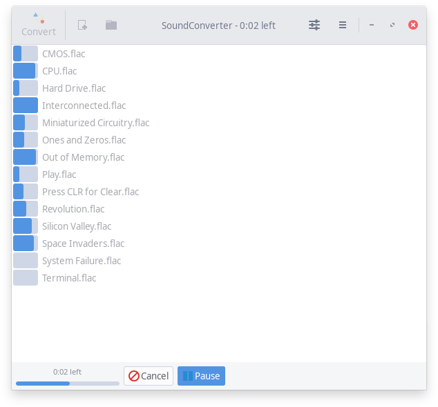
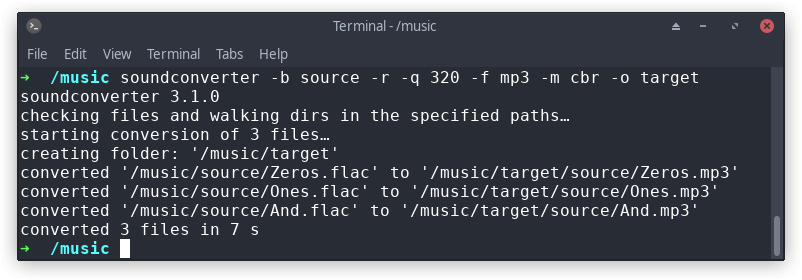

# SoundConverter

 A simple sound converter
application for the GNOME environment. It reads anything the GStreamer library can
read, and writes **Ogg Vorbis**, **FLAC**, **Wave**, **MP3** and **M4A** files.

This application is somewhat less fast than various command line tools.
Not a whole lot, however, and not enough to make me worry about
performance for the foreseeable future. If you want ultimate
performance, the command line tools are always going to be preferable.

<p align="center">
    
</p>

<p align="center">
    
</p>

## Building and Installation

Ubuntu and Arch packages exist in the official repositories.

Installing from source requires distutils-extra

```bash
git clone https://github.com/kassoulet/soundconverter.git
cd soundconverter
git checkout py3k
sudo python3 setup.py install
soundconverter
```

## Help

For command line args, see

```bash
soundconverter --help
gst-launch-1.0 --help-gst
```

and https://gstreamer.freedesktop.org/documentation/application-development/appendix/checklist-element.html

## Testing

To start unittests, use

```bash
sudo python3 setup.py install
python3 tests/test.py
```

## Copyright and Acknowledgements

Copyright 2004 Lars Wirzenius

Copyright 2005-2020 Gautier Portet

Co-author Sezanzeb

Thanks to: Guillaume Bedot, Dominik Zabłotny, Noa Resare, Nil Gradisnik, Elias Autio, Thom Pischke, Qball Cow, Janis Blechert, Brendan Martens, Jason Martens, Wouter Stomp, Joe Wrigley, Jonh Wendell, Regis Floret, Toni Fiz, Seketeli Apelete, Cristiano Canguçu, Adolfo González Blázquez, Marc E., Tobias Kral, Hanno Böck, Pedro Alejandro López-Valencia, James Lee, Christopher Barrington-Leigh, Thomas Schwing, Remi Grolleau, Julien Gascard, Kamil Páral, Stefano Luciani, Martin Seifert, Claudio Saavedra, Ken Harris, Jon Arnold, Major Kong, Uwe Bugla


This program is free software; you can redistribute it and/or modify it
under the terms of the GNU General Public License as published by the
Free Software Foundation; version 3 of the License.

This program is distributed in the hope that it will be useful, but
WITHOUT ANY WARRANTY; without even the implied warranty of
MERCHANTABILITY or FITNESS FOR A PARTICULAR PURPOSE. See the GNU General
Public License for more details.

You should have received a copy of the GNU General Public License along
with this program; if not, write to the Free Software Foundation, Inc.,
59 Temple Place, Suite 330, Boston, MA 02111-1307 USA

